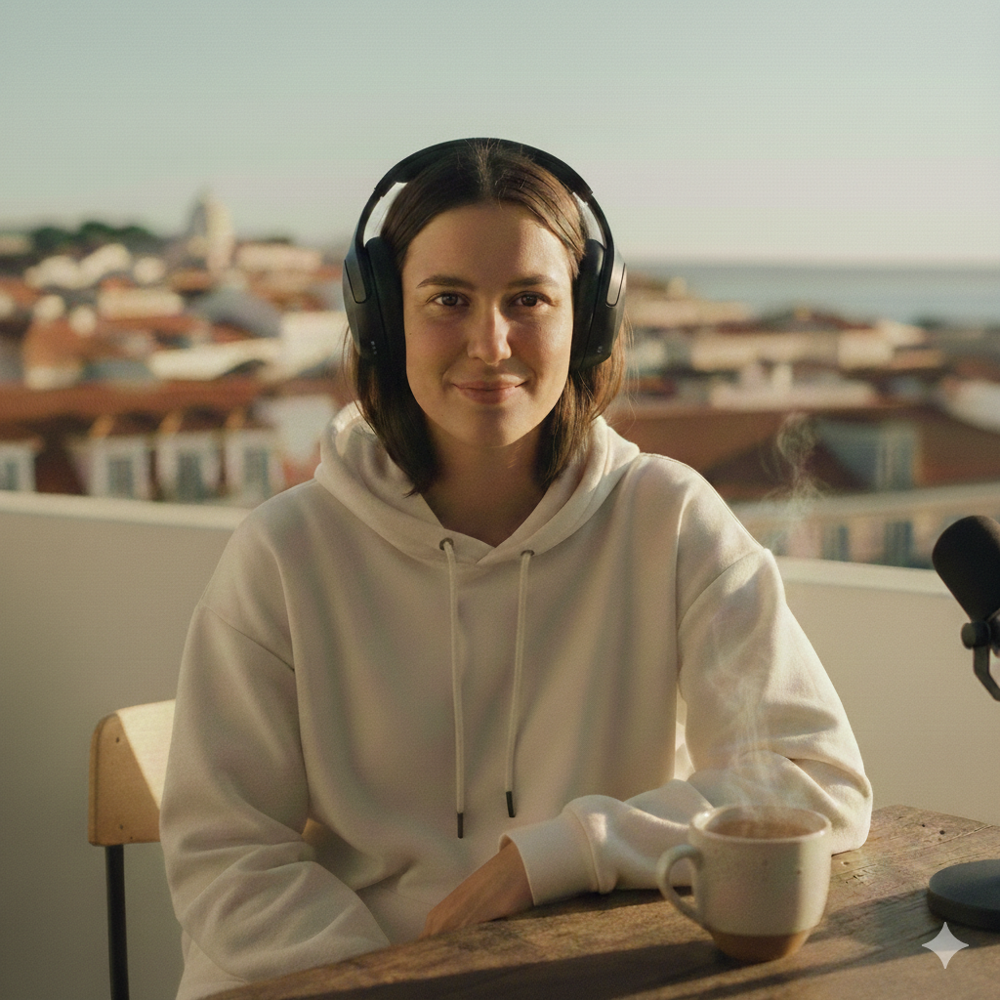

# Tech & Chill: O Podcast da Sofia ;)

  

## 📒 Descrição

O **Tech & Chill** é um podcast diário focado em curadoria de notícias tecnológicas, desenhado para soar o mais humano e natural possível. Através da persona **Sofia**, o projeto explora como a IA Generativa pode capturar nuances culturais, sarcasmo e ritmos de fala específicos do Português Europeu, fugindo do tom robótico tradicional das assistentes virtuais.

## 🤖 Tecnologias Utilizadas

* **Gemini (Google):** Para a criação da persona detalhada e redação dos guiões (scripts) com tom sarcástico.
* **ElevenLabs:** Para a síntese de voz de alta fidelidade (Português de Portugal) e clonagem de estilo vocal.
* **Suno/Udio:** Para a geração da banda sonora (lo-fi tech) e vinhetas de abertura/fecho em loop.
* **Adobe Podcast / Audacity:** Para a limpeza de áudio e mixagem final dos efeitos de glitch.

## 🧐 Processo de Criação

1. **Definição da Persona:** Criámos a "Sofia", uma jovem lisboeta de 24 anos, cujos traços de personalidade (viciada em café, irónica, dinâmica) guiam toda a escrita do guião.
2. **Curadoria de Conteúdo:** Utilizámos IAs para resumir notícias de fontes como *SAPO Tek* e *Wired*, adaptando a linguagem para um estilo de "áudio de WhatsApp".
3. **Engenharia de Prompt Vocal:** Ajustámos a estabilidade da voz no ElevenLabs para 40%, permitindo maior variação emocional e menos monotonia.
4. **Design Sonoro:** Desenvolvemos prompts específicos para que a música de encerramento terminasse na mesma nota da abertura, criando um loop infinito para prender o ouvinte.

### 🎨 Refinamento do Avatar (Iterações de Design)

A criação da **Sofia** não foi um processo de um único clique. Para atingir o nível "Natty" (realista), foi realizado um trabalho de direção de arte através de múltiplas iterações:

1. **Conceito Inicial:** Geração da persona com base no perfil jovem e urbano de Lisboa.
2. **Correção de Artefatos:** Identificação e remoção de elementos que denunciavam a IA, como fios de auscultadores desnecessários e fones duplicados no pescoço.
3. **Ajuste de Anatomia e Realismo:** Refinamento da simetria ocular e correção da cor dos iniciais com heterocromia, para olhos castanho escuro, garantindo consistência com a descrição da persona.
4. **Iluminação e Ambiente:** Ajuste para luz natural (Golden Hour) para integrar o avatar com o cenário de fundo de Lisboa de forma orgânica.

## 🚀 Resultados

* **Episódio Piloto:** Um áudio de 1 minuto que cobre notícias de IA e gadgets com fluidez natural.
* **Identidade Sonora:** Vinhetas exclusivas que misturam o ambiente urbano de Lisboa com sintetizadores tecnológicos.
* **Persona Consistente:** Uma marca vocal reconhecível que pode ser escalada para episódios diários sem necessidade de gravação humana.

## 💭 Reflexão

O maior desafio foi evitar o "vale da estranheza" (Uncanny Valley). Criar algo *natty* com IA exige mais do que apenas converter texto em fala; exige entender pausas, tiques de linguagem locais e o timing de uma piada. A tecnologia já permite o realismo, mas a "alma" do conteúdo ainda depende de um bom design de persona e edição final do áudio.
